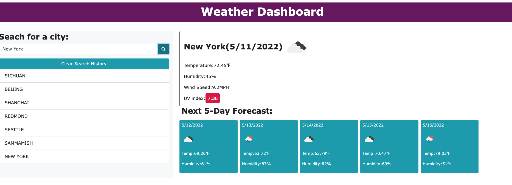

# Weather_Dashboard_App

## Description

This is a weather dashboard with form inputs, you can get the current and the future weather conditions for that city by clicking the searching a city button.

## How to use the application

WHEN you search for a city, the weather dashboard show you the current and future wether of this city;
WHEN you view current weather conditions for a city, it shows you the city name, the date, an icon representation of weather conditions, the temperature, the humidity, the wind speed, and the UV index;
WHEN you view the UV index, it shows you a color that indicates whether the conditions are favorable, moderate, or severe;
WHEN you view future weather conditions for a city, it shows you a 5-day forecast that displays the date, an icon with weather condition descriptions , the temperature, the wind speed, and the humidity;
WHEN you click on a city in the search history, it shows you current and future conditions for that city again;

## Live Link
https://jean424.github.io/Weather_Dashboard_App/
 
